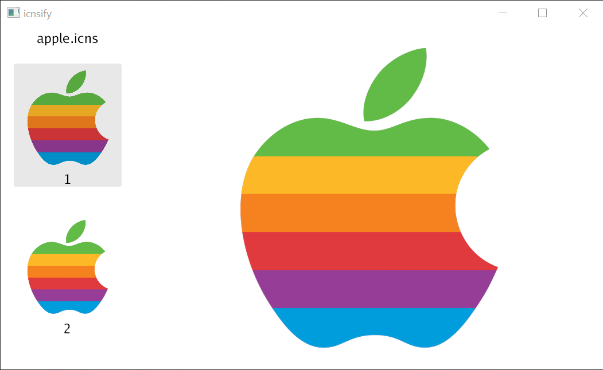

# icns

Easily convert `.jpg` and `.png` to `.icns` with the command line tool `icnsify`, or use the library to convert from any `image.Image` to `.icns`.

`go get github.com/jackmordaunt/icns/v4`

`icns` files allow for high resolution icons to make your apps look sexy. The most common ways to generate icns files are:

1. `iconutil`, which is a Mac native cli utility.
2. `ImageMagick` which adds a large dependency to your project for such a simple use case.

With this library you can use pure Go to create `icns` files from any source image, given that you can decode it into an `image.Image`, without any heavyweight dependencies or subprocessing required. You can also use it to create icns files on windows and linux (thanks Go).

A small CLI app `icnsify` is provided allowing you to create icns files using this library from the command line. It supports piping, which is something `iconutil` does not do, making it substantially easier to wrap or chuck into a shell pipeline.

Note: All icons within the `icns` are sized for high dpi retina screens, using the appropriate `icns` OSTypes.

## GUI

`preview` is a gui for displaying `icns` files cross-platform.

### Go Tool

```
go install github.com/jackmordaunt/icns/cmd/preview@latest
```

### Clone

```
git clone https://github.com/jackmordaunt/icns
cd icns/cmd/preview && go install .
```

Note: Gio cannot be cross-compiled right now, so there are no `preview` builds in releases.
Note: `preview` has its own `go.mod` and therefore is versioned independently (unversioned).



## Windows Explorer thumbnails

`cmd/shell-extension` is a Windows shell extension that renders `.icns` thumbnails in Explorer. It is a COM server written in Go and built as a DLL; see [its readme](cmd/shell-extension/readme.md) for build and registration steps.

## Command Line

### Go Tool

```
go install github.com/jackmordaunt/icns/v4/cmd/icnsify@latest
```

### [Scoop](https://scoop.sh/)

```powershell
scoop bucket add extras # Ensure bucket is added first
scoop install icnsify
```

Or from my personal bucket:

```powershell
scoop bucket add jackmordaunt https://github.com/jackmordaunt/scoop-bucket 
scoop install jackmordaunt/icns # Name is defaulted to repo name. 
```

### [Winget](https://learn.microsoft.com/en-us/windows/package-manager/)

```powershell
winget install icnsify
```

### [Brew](https://brew.sh)

```sh
brew tap jackmordaunt/homebrew-tap # Ensure tap is added first.
brew install icnsify
```

### Clone

```
git clone https://github.com/jackmordaunt/icns
cd icns && go install ./cmd/icnsify
```

Pipe it

`cat icon.png | icnsify > icon.icns`

`cat icon.icns | icnsify > icon.png`

Standard

`icnsify -i icon.png -o icon.icns`

`icnsify -i icon.icns -o icon.png`

## Library

`go get github.com/jackmordaunt/icns/v4`

```go
func main() {
        pngf, err := os.Open("path/to/icon.png")
        if err != nil {
                log.Fatalf("opening source image: %v", err)
        }
        defer pngf.Close()
        srcImg, _, err := image.Decode(pngf)
        if err != nil {
                log.Fatalf("decoding source image: %v", err)
        }
        dest, err := os.Create("path/to/icon.icns")
        if err != nil {
                log.Fatalf("opening destination file: %v", err)
        }
        defer dest.Close()
        if err := icns.Encode(dest, srcImg); err != nil {
                log.Fatalf("encoding icns: %v", err)
        }
}
```

## Development

The repository is a Go workspace of three modules:

| Module | Contents | Why separate |
|---|---|---|
| `github.com/jackmordaunt/icns/v4` (root) | The library and `cmd/icnsify` | Dependency-free apart from `nfnt/resize`; one tag versions both |
| `github.com/jackmordaunt/icns/cmd/preview` | The Gio GUI | Keeps Gio's dependency tree out of library consumers' module graphs |
| `github.com/jackmordaunt/icns/cmd/shell-extension` | The Windows DLL | Windows-only and needs cgo (mingw) |

`go.work` ties them together, so every build inside the checkout uses the working-tree library and gopls sees the whole repository. Note that `./...` only matches the module you are in; to cover all three from the root, name them:

```
go test ./... ./cmd/preview/... ./cmd/shell-extension/...
```

The two command modules require the library at its latest tag; the versioned `replace` in `go.work` resolves that tag to the working tree inside the checkout, which is also what lets the tree build before the tag exists.

Releasing: tag the root module (`vX.Y.Z`), which releases the library and `icnsify` together. Then tidy the two command modules outside the workspace so their `go.sum` files learn the new version, and bump the `replace` line in `go.work` to match:

```powershell
$env:GOWORK = 'off'; go mod tidy; Remove-Item Env:GOWORK   # in cmd/preview, then cmd/shell-extension
```

## Roadmap

- [x] Encoder: `image.Image -> .icns`
- [x] Command Line Interface
  - [x] Encoding
  - [x] Pipe support
  - [x] Decoding
- [x] Implement Decoder: `.icns -> image.Image`
- [x] Symmetric test: `decode(encode(img)) == img`
- [x] Windows Explorer thumbnails

## Coffee

If this software is useful to you, consider buying me a coffee!

[https://liberapay.com/JackMordaunt](https://liberapay.com/JackMordaunt)
